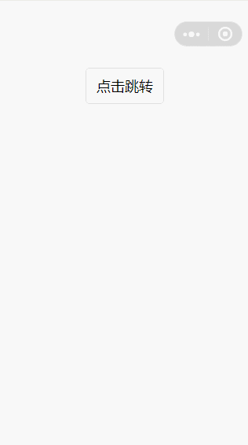

# navigation-bar

小程序自定义组件

> 使用此组件需要依赖小程序基础库 2.2.1 以上版本，同时依赖开发者工具的 npm 构建。具体详情可查阅[官方 npm 文档](https://developers.weixin.qq.com/miniprogram/dev/devtools/npm.html)。

## 使用效果


## 使用方法

1. 安装 navigation-bar：

```
npm install --save miniprogram-navigation-bar
```
2. 在app.json中设置：
```json
{
  "window": {
    "navigationStyle": "custom"
  }
}
```

3. 在需要使用 navigation-bar 的页面 page.json 中添加 navigation-bar 自定义组件配置

```json
{
  "usingComponents": {
    "navigation-bar": "miniprogram-navigation-bar"
  }
}
```
4. WXML 文件中引用 navigation-bar

``` xml
<navigation-bar bindnavback="onnavback" enable="{{enable}}" show-loading="{{loading}}" title="{{title}}" ></navigation-bar> 
```
**navigation-bar的属性介绍如下：**

| 属性名                  | 类型        | 默认值     | 是否必须        | 说明                                              |
|------------------------|-------------|------------|----------------|---------------------------------------------------|
| title                  | String     | 微信 | 否             | 导航栏标题文字内容                                  |
| enable                 | Boolean     | true       | 否             | 是否可以返回上一页面                                |
| delta                  | Number      | 1          | 否             | 返回的页面数，如果delta大于现有页面数，则返回到首页    |
| show-loading           |Boolean      | false      | 否             | 是否展示加载动画                                    |
| bg-style               | String      |            | 否             | 可设定导航栏样式，如'background-color: green'       |
| title-style            | String      |            | 否             | 可设定导航栏标题样式，如'color: black'               |
| text-style            | String      |white            | 否             |设置返回按钮颜色， 仅支持 white 和 black               |


**Tip:** navigation-bar 中包含 slot 节点，位置固定于 navigation-bar 的最右侧，用于承载使用者提供的 wxml 结构
